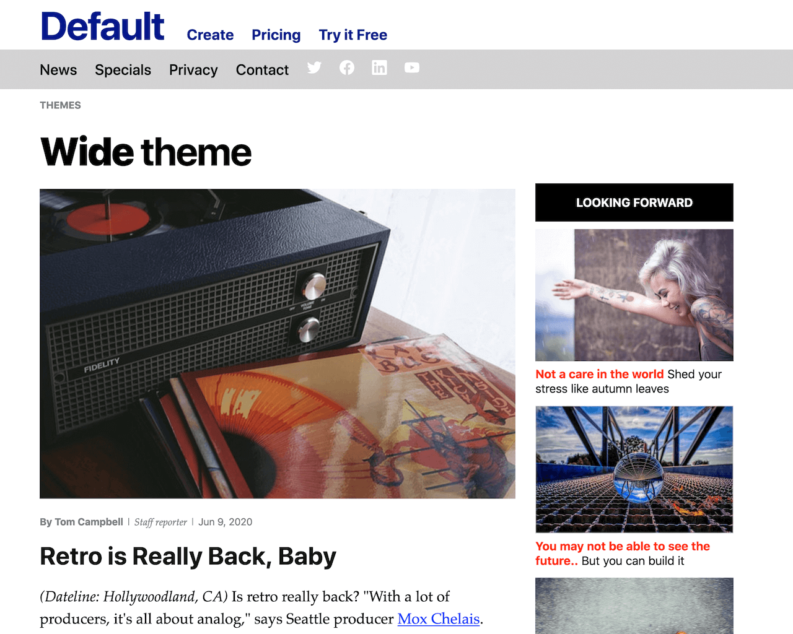

===
#theme="new-wide"
#theme="pillar"
#theme="foo"
theme="textual"
sidebar="left"
mode="light"
===

# BUG: Using h2 messes up bullets
# L1 Easy tests
## L2 easy
### L3 easy
#### L4 easy
##### L5 easy
###### L6 easy

# L1 out of order test
### L3  out of order

#### L4 to see bottom issue

## L2

Hey, here I am at level 2

### Level 3 will stress text long titles for sure

#### L4

## Bug: child TOML pagetype is being ignored

{{ inc "theme-and-variations.md" }}
{{ inc "mdemo.md" }}

# Metabuzz Markdown quick reference

**Table of contents** 

* [Common text formatting](#common-text-formatting)
* [Links](#links)

## Markdown syntax

Here's how markdown appears in the **{{.FrontMatter.Theme }}** theme
{{- if .FrontMatter.PageType }}
with the PageType **{{ .FrontMatter.PageType }}**
{{ end }}:
## Common text formatting

#### You type:
```
Normal body text, **strong**, ~~strikethrough~~, and with *emphasis*.
```

#### It shows as:
Normal body text, **strong**, ~~strikethrough~~, and with *emphasis*.

Horizontal rule:

#### You type:
```
---
```

#### It shows as:
---

## Links

#### You type:
```
[link text](https://appscripting.com)
```

#### It shows as:
[link text](https://appscripting.com)




<svg xmlns="http://www.w3.org/2000/svg" width="32px" height="32px"  viewBox="0 0 20 20" fill="currentColor">
  <path fill-rule="evenodd" d="M12 1.586l-4 4v12.828l4-4V1.586zM3.707 3.293A1 1 0 002 4v10a1 1 0 00.293.707L6 18.414V5.586L3.707 3.293zM17.707 5.293L14 1.586v12.828l2.293 2.293A1 1 0 0018 16V6a1 1 0 00-.293-.707z" clip-rule="evenodd" />
</svg>

Run `themevars` with the name of the them:

```
./themevars textual
```


(Redmond, WA, November 17, 2020) Hey people!

Metabuzz automatically generates an id attribute for each header from h1 to h6 by taking the text of the link itself, reducing it to lowercase, and either replacing spaces and other non-letter characters with hyphens, or removing them altogether.

# Generating these tests


