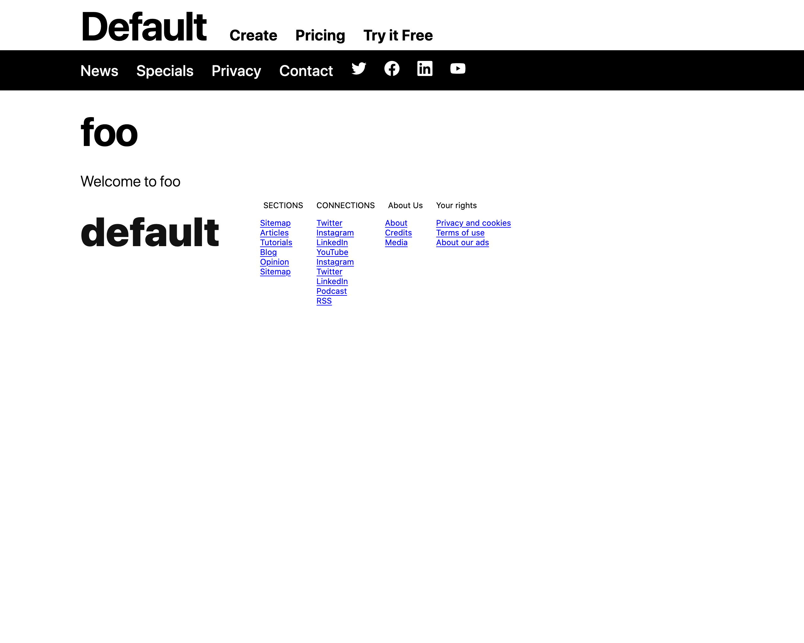

# Metabuzz theme architecture

## TODO: Things to cover
* Explain how --left-margin and --right-margin are used by header,nav,article,footer
* theme names are forced to lowercase internally, so they're not case senstive
* Purpose of --header-footer-width
* Changing `--fg` and `--bg` propagates  `--header-fg`, `--navg-fg`, etc. because they're all based on the first one by default. Of course you're welcome to change that behavior by setting `--header-fg` etc.
* the huge number of contstants like --header-margin-top and so on will come in handy later
with some automated tools
* If you want an image in a header,nav,sidebar,or footer,put them in the either the theme directory or the article directory. Either way they will be copied to the article directory.
* A theme TOML without an "[article]" layout element specified is equivalent to <article>{{ article }}</article>. 
* Feel free to override what's in sizes.css. The presets are there for your convenience. Warn about development on smaller screens because responsive.css mayaffect what you see
* Setting rem/em size, now with more @media queries. https://css-tricks.com/rems-ems/
If you just want a tutorial on how to create your own theme, visit the [Tutorial: Creating a custom theme for Metabuzz](tutorial-custom-theme.html) page.
* All font sizes are in rem because it's based on the browser font size.  All other measurements are in em so they expand more naturally.
Metabuzz is designed to let you create attractive, full-featured websites as soon as you've installed the software. All you need to know is the basics of Markdown, and even that's optional, because any text at all is valid Markdown. (See the [CommonMark spec](https://spec.commonmark.org#characters-and-lines) if you're interested).

A Metabuzz site lives in its own directory. Inside it are a number of subdirectories for the site's source (markdown files and graphic assets such as images, `favicon.ico`, site configuration, and helper files for things like embedding tweets or YouTube videos). Some of these directories start with the period or dot character. They're hidden by default on Unix-style systems but otherwise they're no different from any other directory.

There is also a directory holding the output of the site--the rendered HTML. This portion gets copied to the web server when you're ready to publish. If you use Git it's easy to make this happen automatially when you push you repository.

## Creating a Metabuzz site 

First, a quick review showing the steps to build a typical first site after installing Metabuzz. 

###  Run mb new site

Once per website, you need to create the site's directory and starter files.
In this example, the site is creatively named `foo`.

* Type this into your terminal/command prompt:

```
mb new site foo
```

You should get back this message:

```
Created site foo
```

* Now switch to that directory.

```
cd foo
```

## Metabuzz translates Markdown (.md) files into .html files

In general, Metabuzz Markdown files as its input. They are text files that use the extension `.md`. 
Along with the text files there may be asset files such as graphic images in the same directory.
Metabuz then translates the Markdown files into HTML and copies everying into a publication directory. The file `index.md` gets translated into `index.html`, the file `contact.md` is translated into `contact.html`, and so on.
The publication directory is in the root of the same directory as your main source document. It's
called `.pub` by default, and it contains the HTML files web browsers will use to present your site
to the world. (Normally they're copied to a remote site such as Netlify.)

Other files in the same directory as the Markdown file also get copied. HTML files are copied unchanged, as are graphics, sound files, text files, and anything else that might be there. The [site configuration file](site-file.html) lets you specify files to exclude.

### Note on Markdown file extensions

Metabuzz accepts all common filename extensions for the Markdown source files: 

`.md`,`.md`, `.mdown`, `.mdtext`, `.mdtxt`, `.markdown`, `.mdwn`, `.mkd`, `.mkdn`, and `.text`

## Create the markdown file index.md

You need only a single line of Markdown to create a Metabuzz website. *No additional files are necessary, and no other text is necessary in your Markdown file.*

* Open a text editor type something like this into a file named `index.md`:

```
Welcome to foo
```
 
Users of some Markdown-based sites such as GitHub expect to use `README.md` instead of `index.md`. That's fine too. And because of the prevalance of such systems, if you have both `README.md` and `index.md` in the same directory then `index.md` is ignored and `README.md` gets converted into `index.html`.

* Save your file and exit the editor.

### Build the site and view it

All right. You have your source saved. Time to turn it into a website. You do that with the `mb build` command.


```
mb build
```

You are informed that the site has been built with this simple message. 
The reason it doesn't say more is because just displaying those messages
slows the Metabuzz output significantly.

```
1 file
```

### What just happened

* The file `index.md` you just created got converted into a web page named `index.html` 
* It was copied into a directory named `.pub`. 

Let's load that page into a web browser.

### Load the web page into a browser: Windows users

In Windows, you can load a web page into the browser simply by typing its address:

```
.pub/index.hml
```

### Load the web page into a browser: MacOS 

In MacOS, you load a web page into the browser with the `open` command:

```
open .pub/index.hml
```

The result is a full-featured page:



## Change to a dark theme

Let's see how to use a dark theme instead.

* Open up the `index.md` source file and insert these three lines to the beginning of the file:

```
===
mode = "dark"
===
```

The entire file should look like this:

```
===
mode = "dark"
===
Welcome to foo
```

As you've probably guessed, if a file starts with the `===` line, everything until the next  `===` line is considered a directive that gives clues about how to build the page. It is not page content and does not appear in the HTML output file. This is known as [front matter](front-matter.html). Technically this is considered a separate document from the CommonMark document, even though they're in the same file.  

* Rebuild the site:

```
mb build
```

And you're told:

```
1 file
```

* Refresh the page in your web browser to view the changes. 

You'll see the page in a color scheme more suited to working 
in low-light conditions. 

## How Metabuzz creates a page

So where did the rest of the web page come from?

The 5 parts of a page generated by Metabuzz are:

* Header
* Navbar
* Article
* Sidebar
* Footer

They're called [page elements](glossary.html#page-elments). They are all generated from templates written in Markdown or HTML, and combined with a set of CSS files, graphics, and perhaps other Markdown files to create the output HTML file. All files are optional, and they're all assembled based on instructions in the theme's TOML file, discussed next.

## Files that make up a Metabuzz theme

Let's take a look at a complete Metabuzz theme with no pagetypes.
In this example the theme is named `mytheme`, so it's
stored in a directory by that name.

```
mytheme
├── mytheme.css
├── mytheme.toml
├── fonts.css
├── footer.md
├── header.md
├── layout.css
├── nav.md
├── reset.css
├── responsive.css
├── sidebar-left.css
├── sidebar-right.css
├── sidebar.md
├── sizes.css
├── theme-dark.css
└── theme-light.css
```

The only necessary files required for a theme are the TOML file, `theme-dark.css`, and `theme-light.css`. The list above is typical of the Metabuz built-in theme set, because they have hundreds of features built into a framework they all share.

The following are named after the theme:

* The name of the theme directory 
* The name of the main CSS file
* The name of the [TOML file](#toml-file) for this theme

<a id="toml-file"></a>
## The theme's TOML file

The TOML file directs the creation of all parts of the web page.

## Stylesheets Metabuzz normally uses

Metabuzz distinguishes between what it calls "root stylesheets" and "stylesheets". 

**reset.css** creates a consistent look across all browsers for a blank HTML document.

```
stylesheets = [ "sizes.css", "theme-light.css", 
  "wide.css", "responsive.css"  ]

rootstylesheets = [ "reset.css", "fonts.css", "layout.css" ]
```

### Note

The `stylesheets` and `rootstylesheets` values should
actually be on a single line, but formatting limitations
force theme to be split into two lines in the example below.

```
stylesheets = [ "sizes.css", "theme-light.css", 
  "wide.css", "responsive.css"  ]

rootstylesheets = [ "reset.css", "fonts.css", "layout.css" ]

branding = "Wide Theme"

[nav]
HTML = ""
File = "nav.md"

[header]
HTML = ""
File = "header.md"

[footer]
HTML = ""
File = "footer.md"

[sidebar]
HTML = ""
File = "sidebar.md"
```


A minimal web page generated by Metabuzz employing the world's
most useless theme, here called `mytheme`, looks like this:
```
<!DOCTYPE html>
<html lang=en>
<head>
<meta charset="utf-8">
<meta name="viewport" content="width=device-width,initial-scale=1">

<title>Welcome to My Site</title>

<meta name="description" content="foo">
<link rel="stylesheet" href="themes/mytheme/reset.css">
<link rel="stylesheet" href="themes/mytheme/fonts.css">
<link rel="stylesheet" href="themes/mytheme/layout.css">
<link rel="stylesheet" href="themes/mytheme/sizes.css">
<link rel="stylesheet" href="themes/mytheme/theme-light.css">
<link rel="stylesheet" href="themes/mytheme/mytheme.css">
<link rel="stylesheet" href="themes/mytheme/responsive.css">

</head>
<body>

<header>Header</header>

<nav>Navbar</nav>

<article><h1 id="my-site">foo</h1>
<p>Welcome to My Site</p>
</article>

<footer>Footer</footer>

</body>
</html>
```
## Directory naming

A Metabuzz theme takes its name from the name of its containing
directory. Themes are stored in a directory named `.mb/themes`. 


