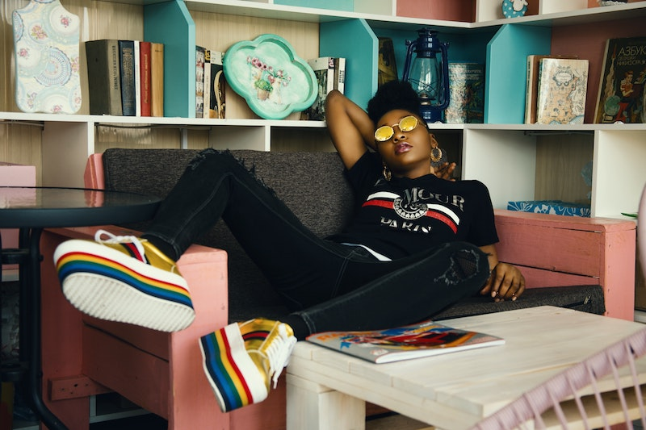

===
theme = "Chill"
===

# Chill theme

### You've Got to Check Out This Photographer 

#### By **Tom Campbell** | March 18, 2010

##### Photo by [Godisable Jacob](https://www.pexels.com/@godisable-jacob-226636) from **Pexels**

Use this theme for most of the pages on your site. It's focused and easy
to read, with an aside (sidebar) for additional information. For a 
high-impact home page for marketing purposes, use the 
[home](chill-home.html) page type.

## When to use which pagetype

While this page has a navbar, the [home pagetype](chill-home.html) doesn't.
That's because you won't want users navigating away from the home page.
It's not visited very often by the majority of your audience.
On the rest of the site they expect to move around at will.

---

### Getting the most out of this theme

