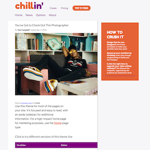
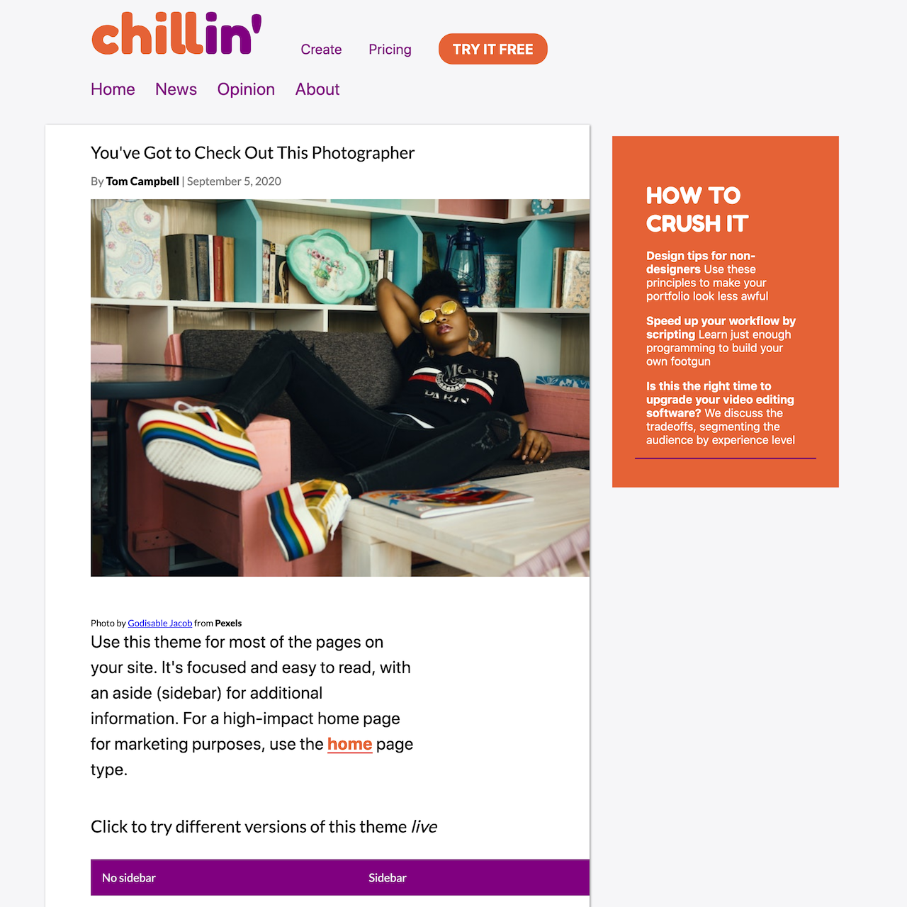

===
theme="debut"
pagetype="gallery"
sidebar="none"

[List]
Title="METABUZZ THEME GALLERY"
DemoTheme="gal2"
===
# **{{ .FrontMatter.List.DemoTheme }}** theme 

###
* 
* 
* 
* 
* 
* 

 
  ## {{ if .FrontMatter.List.DemoPageType }} PageType: **{{ .FrontMatter.List.DemoPageType }}**{{ else }}## {{ end }}

### About {{ .FrontMatter.List.DemoTheme }}
{{ inc "description.md" }}

{{ inc "variations.md" }}

### Creator 
[Tom Campbell](https://metabuzz.com)

### License 
[MIT](https://metabuzz.com)

