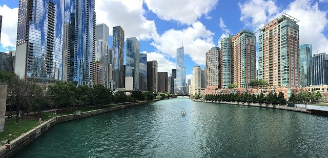

Pillar is the basis of about half of the Metabuzz themes. It gets its name 
from that fact that it stands in a column in the middle of the page, with 
gaps on the right and left sides.

This differs from the [Default](../default/index.html) theme, which is the basis
of most other Metabuzz themes. Default has a header and footer that stretch
to the ends of the page. Pillar themes reduce distraction because they tend to be 
less information dense, making it easier to focus on the article text. 
The default themes leave more room on the page for multiple kinds of content.

