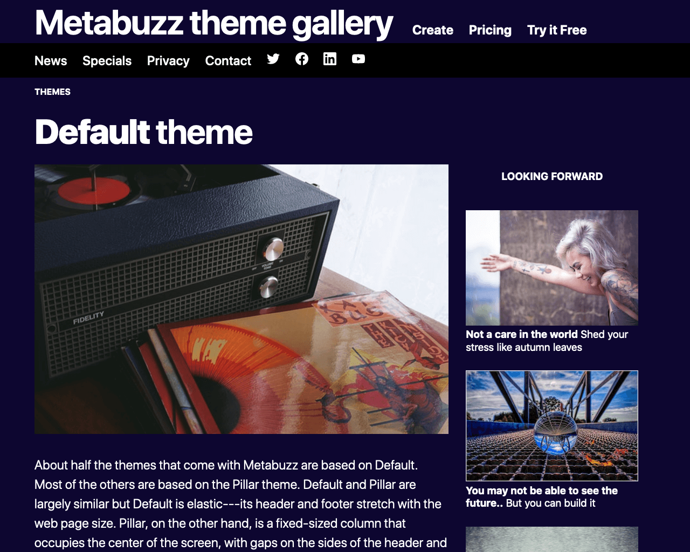
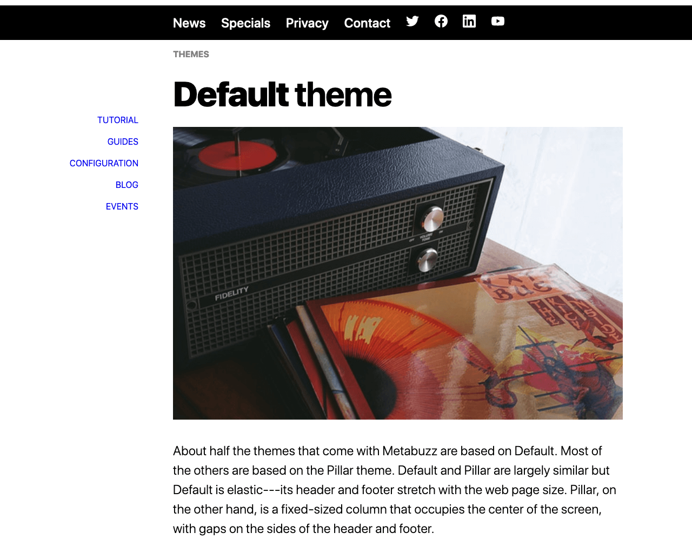

===
theme="debut"
pagetype="gallery"
sidebar="none"

[List]
Title="METABUZZ THEME GALLERY"
DemoTheme="wide"
Next="future"
===

# **{{ .FrontMatter.List.DemoTheme }}** theme
* 
  ## {{ if .FrontMatter.List.DemoPageType }} PageType: **{{ .FrontMatter.List.DemoPageType }}**{{ else }}## {{ end }}
  An exceptionally lightweight, general-purpose theme with high information density and maximum flexibility.   
  ### Modes
  [Light theme](light.html) [Dark theme](dark.html)
  ### Sidebar support
  Light theme: [Left](light-sidebar-left.html) [Right](light-sidebar-right.html)  
  Dark theme: [Left](dark-sidebar-left.html) [Right](dark-sidebar-right.html) 
  #### CREATOR [Tom Campbell](https://metabuzz.com)
  #### LICENSE [MIT](https://metabuzz.com)
  ### Next: [{{ .FrontMatter.List.Next }}](../{{- .FrontMatter.List.Next -}}/index.html) 

# **{{ .FrontMatter.List.DemoTheme }}** theme
* 
  ## **Mode:** Dark
  ## **Sidebar:** Right

# **{{ .FrontMatter.List.DemoTheme }}** theme
* 
  ## **Mode:** Light 
  ## **Sidebar:** Left

# **{{ .FrontMatter.List.DemoTheme }}** theme
* 
  ## **Mode:** Dark
  ## **Sidebar:** None 

# **{{ .FrontMatter.List.DemoTheme }}** theme
* 
  ## **Mode:** Light
  ## **Sidebar:** None 

