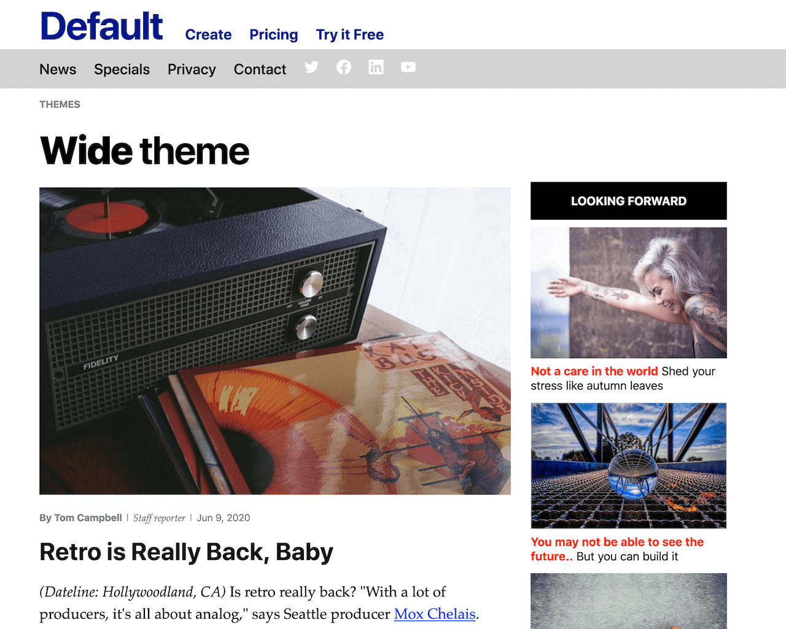

===
theme="new-wide"
sidebar="left"
mode="light"
===


# hello, world.

This is what the empty theme looks like.
# Wide
* [Wide Left sidebar](wide-left-sidebar.html)
* [Wide No sidebar](wide-index.html)
* [Wide Right sidebar](wide-right-sidebar.html)

[Home](index.html)

# Pillar
* [Pillar Left sidebar](pillar-left-sidebar.html)
* [Pillar No sidebar](pillar-index.html)
* [Pillar Right sidebar](pillar-right-sidebar.html)


[Home](./index.html)

# Metabuzz Markdown quick reference

**Table of contents** 

* [Common text formatting](#common-text-formatting)
* [Links](#links)

## Markdown syntax

Here's how markdown appears in the **{{.FrontMatter.Theme }}** theme
{{- if .FrontMatter.PageType }}
with the PageType **{{ .FrontMatter.PageType }}**
{{ end }}:
## Common text formatting

#### You type:
```
Normal body text, **strong**, ~~strikethrough~~, and with *emphasis*.
```

#### It shows as:
Normal body text, **strong**, ~~strikethrough~~, and with *emphasis*.

Horizontal rule:

#### You type:
```
---
```

#### It shows as:
---

## Links

#### You type:
```
[link text](https://appscripting.com)
```

#### It shows as:
[link text](https://appscripting.com)



